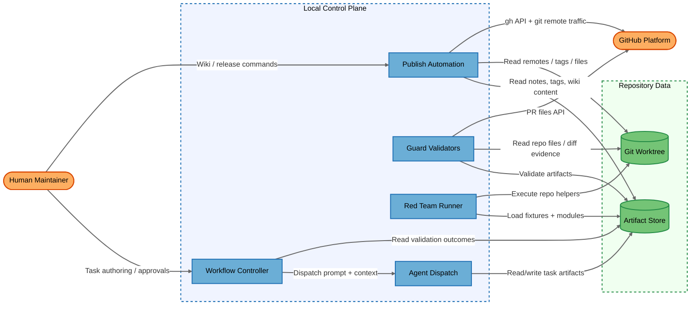
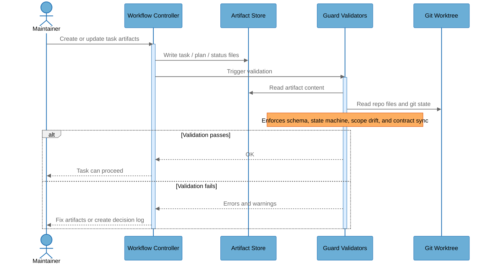
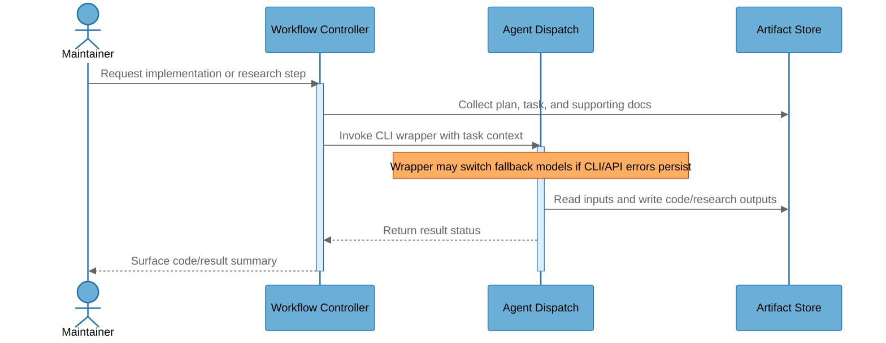
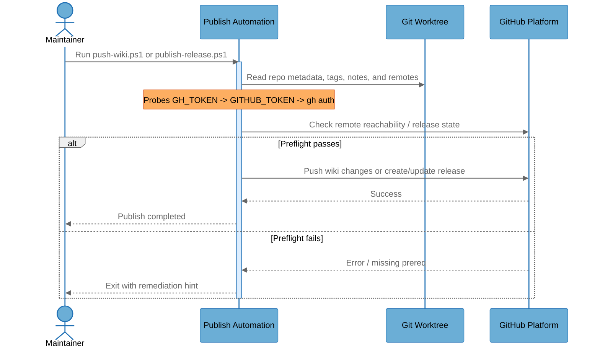

# Architecture Overview

## System Purpose

This repository is an artifact-first workflow framework for multi-agent engineering work. It defines how tasks, research, plans, code, verification artifacts, decision logs, red-team exercises, and template sync are authored, validated, and published.

The system's users are maintainers, contributors, and AI-assisted operators who interact with local scripts plus GitHub Actions. The repository itself acts as a control plane: it stores the workflow contracts, runs validators, dispatches external CLIs, and can publish wiki and release state.

## Key Components

| Component | Type | Description |
|-----------|------|-------------|
| Human Maintainer | External Interactor | Maintainer or contributor who edits artifacts, runs local scripts, and approves or overrides workflow decisions. |
| Workflow Controller | Process | The orchestration layer represented by `CLAUDE.md`, `AGENTS.md`, `docs/orchestration.md`, and related workflow contracts. |
| Agent Dispatch | Process | Local PowerShell wrappers such as `artifacts/scripts/Invoke-GeminiAgent.ps1` and `artifacts/scripts/Invoke-CodexAgent.ps1` that invoke external CLIs. |
| Guard Validators | Process | Python validators that check artifact schema, status transitions, contract sync, prompt regressions, and scope drift. |
| Red Team Runner | Process | `artifacts/scripts/run_red_team_suite.py`, which loads modules, copies fixtures, runs subprocesses, and validates static/live drill behavior. |
| Publish Automation | Process | Wiki/release tooling including `github_publish_common.ps1`, `push-wiki.ps1`, and `publish-release.ps1`. |
| Artifact Store | Data Store | Markdown, JSON, and evidence files under `artifacts/` plus other workflow documents used as source-of-truth inputs. |
| Git Worktree | Data Store | The local repository checkout, git metadata, template mirror, and supporting files read by validators and publish scripts. |
| GitHub Platform | External Service | Remote GitHub APIs and git remotes used for PR replay, auth probing, wiki publish, and release publish. |

## Component Diagram

## Top Scenarios

### Scenario 1: Task Authoring And Guard Validation

The maintainer creates or updates a task, plan, or verification artifact. The guard validators then read both the new artifact set and the local worktree to confirm schema, state transitions, scope drift, and contract sync before the task is allowed to progress.

### Scenario 2: Agent Dispatch And Artifact Writeback

The workflow controller packages task context and sends it to a local wrapper for Codex or Gemini. The wrapper invokes the external CLI, which reads prompt/context input and writes results back into repo artifacts or code changes.

### Scenario 3: Wiki Or Release Publish Preflight

The maintainer invokes a publish script. Shared PowerShell helpers probe available credentials, confirm `gh` CLI and remote reachability, then proceed to wiki or release operations only when preflight checks pass.

### Scenario 4: Security Scan CI

GitHub Actions runs three complementary low-dependency checks: dependency advisories via `pip-audit`, a repo-local secrets scan, and a repo-local static rules scan for workflow and script foot-guns. This scenario is intentionally simple: checkout, setup Python, run the checks, fail the PR when the repo introduces a blocked condition.

## Technology Stack

| Layer | Technologies |
|-------|--------------|
| Languages | Python, PowerShell, Markdown, YAML, JSON |
| Frameworks | pytest, GitHub Actions, gh CLI, local AI CLI wrappers |
| Data Stores | Git worktree, Markdown artifacts, JSON status files, diff evidence files |
| Infrastructure | Local developer workstations, GitHub-hosted Ubuntu runners, GitHub repository and API |
| Security | SHA-pinned actions, `pip-audit`, contract/status guards, prompt regression, red-team suite, repo-local security scan |

## Deployment Model

The repository operates as a local-first workflow control plane with CI support. There are no inbound service ports or long-lived daemons declared in the repo. The main execution topology is:

- local workstation or shell session runs PowerShell / Python scripts against the current checkout,
- GitHub Actions runner replays the same validation workflows in a read-only token context,
- outbound HTTPS and git traffic reach GitHub APIs and repository remotes,
- workflow truth is stored as repo files rather than a separate service database.

Because the system is local-first, most directly exploitable threats require contributor, maintainer, or local-process footholds rather than anonymous network access. That shifts the threat model away from public web attacks and toward workflow abuse, outbound target control, credential handling, and artifact integrity.

## Security Infrastructure Inventory

| Component | Security Role | Configuration | Notes |
|-----------|---------------|---------------|-------|
| `workflow-guards.yml` | CI workflow validation | Read-only token, SHA-pinned actions, `persist-credentials: false` | Main contract/status/prompt validation pipeline |
| `security-scan.yml` | Dependency + regression scanning | `pip-audit` plus repo-local `secrets` and `static` modes | Added in TASK-980 to close repo-specific blind spots |
| `guard_status_validator.py` | State machine and scope control | Artifact schema checks, scope drift checks, optional override log | High-trust validation path |
| `guard_contract_validator.py` | Root/template contract sync | Verifies workflow/template/README alignment | Prevents insecure template drift |
| `prompt_regression_validator.py` | Prompt contract enforcement | Static prompt regression cases | Protects workflow prompt invariants |
| `run_red_team_suite.py` | Control-plane exercise harness | Static and live drill phases | Detects workflow regressions, but also expands execution surface |
| `github_publish_common.ps1` | Publish preflight | Credential probe, gh CLI check, remote reachability check | Shared helper for wiki/release flows |

## Repository Structure

| Directory | Purpose |
|-----------|---------|
| `artifacts/` | Workflow source-of-truth artifacts, validator scripts, reports, evidence, and status files |
| `docs/` | Workflow rules, schema definitions, state machine, premortem guidance, and role docs |
| `.github/` | Copilot instructions, memory bank, prompts, skills, workflow automation, and repo metadata |
| `template/` | Sync target containing the reusable clean version of the workflow system |
| `wiki/` | GitHub Wiki source content managed by publish tooling |
| `external/` | Third-party repository integrations kept out of this threat-model scope |