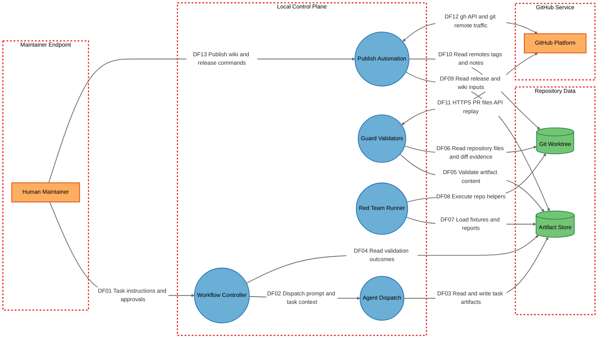

# Threat Model

## Data Flow Diagram

## Element Table

| Element | Type | TMT Category | Description | Trust Boundary |
|---------|------|--------------|-------------|----------------|
| Human Maintainer | External Interactor | `SE.EI.TMCore.Operator` | Maintainer or contributor who authors artifacts, runs scripts, and can approve overrides or publish actions. | Maintainer Endpoint |
| Workflow Controller | Process | `SE.P.TMCore.Orchestrator` | Workflow contracts and orchestration docs that define allowed task progression and agent roles. | Local Control Plane |
| Agent Dispatch | Process | `SE.P.TMCore.CLIProxy` | PowerShell wrappers that invoke external AI CLIs with repo context. | Local Control Plane |
| Guard Validators | Process | `SE.P.TMCore.Validator` | Python validators for schema, status transitions, contract sync, prompt regressions, and diff evidence replay. | Local Control Plane |
| Red Team Runner | Process | `SE.P.TMCore.TestHarness` | Static/live drill harness that imports modules, copies fixtures, and runs subprocess-based validations. | Local Control Plane |
| Publish Automation | Process | `SE.P.TMCore.ReleaseAutomation` | Wiki/release scripts that probe auth, read repo state, and interact with GitHub. | Local Control Plane |
| Artifact Store | Data Store | `SE.DS.TMCore.FileStore` | Markdown, JSON, and evidence files used as workflow truth and validation inputs. | Repository Data |
| Git Worktree | Data Store | `SE.DS.TMCore.FileStore` | The local checkout, git metadata, template mirror, and repository files used by validators and publish scripts. | Repository Data |
| GitHub Platform | External Interactor | `SE.EI.TMCore.ExternalAPI` | Remote GitHub APIs and git remotes used for PR file replay, release management, and wiki publishing. | GitHub Service |

## Data Flow Table

| ID | Source | Target | Protocol | Description |
|----|--------|--------|----------|-------------|
| DF01 | Human Maintainer | Workflow Controller | Local file edits / terminal input | Task creation, approvals, and workflow instructions |
| DF02 | Workflow Controller | Agent Dispatch | Local process invocation | Dispatch prompt, task context, and constraints |
| DF03 | Agent Dispatch | Artifact Store | Local file read/write | Agent outputs written back into task artifacts or code summaries |
| DF04 | Workflow Controller | Artifact Store | Local file read | Orchestrator reads validation outcomes and prior artifacts |
| DF05 | Guard Validators | Artifact Store | Local file read | Schema validation, acceptance checks, and scope verification |
| DF06 | Guard Validators | Git Worktree | Local file read / git replay | Reads repo files, archive snapshots, and git-backed diff evidence |
| DF07 | Red Team Runner | Artifact Store | Local file read/write | Loads fixtures and report outputs for static/live drills |
| DF08 | Red Team Runner | Git Worktree | Local subprocess / module load | Executes helper scripts and temp git fixtures |
| DF09 | Publish Automation | Artifact Store | Local file read | Reads notes, wiki content, and release inputs |
| DF10 | Publish Automation | Git Worktree | Local file read / git commands | Reads remotes, tags, and repository metadata |
| DF11 | Guard Validators | GitHub Platform | HTTPS API | Replays GitHub PR changed-files data for diff evidence validation |
| DF12 | Publish Automation | GitHub Platform | HTTPS API / git over HTTPS | Preflight probes, wiki publish, and release publish |
| DF13 | Human Maintainer | Publish Automation | Local command execution | Starts wiki or release operations from local shell |

## Trust Boundary Table

| Boundary | Description | Contains |
|----------|-------------|----------|
| Maintainer Endpoint | Human-operated shell/editor context that can author files and invoke scripts | Human Maintainer |
| Local Control Plane | Repo-local orchestration and automation logic with authority to validate, dispatch, or publish | Workflow Controller, Agent Dispatch, Guard Validators, Red Team Runner, Publish Automation |
| Repository Data | High-trust file-based state used as workflow truth and replay evidence | Artifact Store, Git Worktree |
| GitHub Service | Remote APIs and repository endpoints reached over outbound network traffic | GitHub Platform |